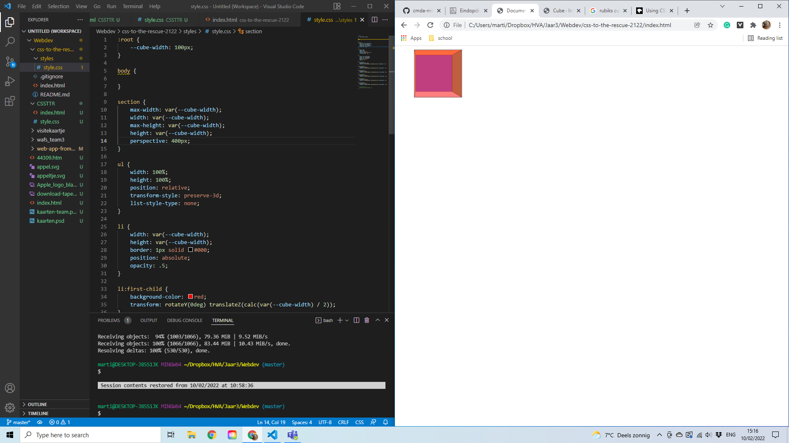
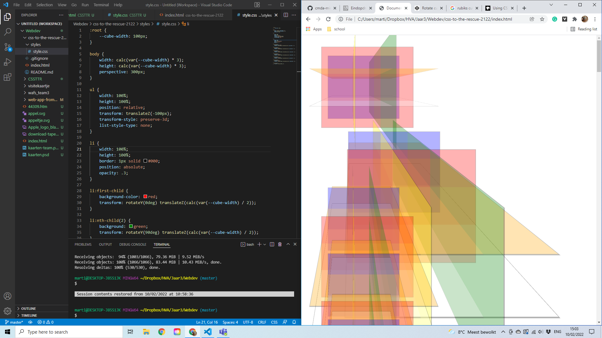
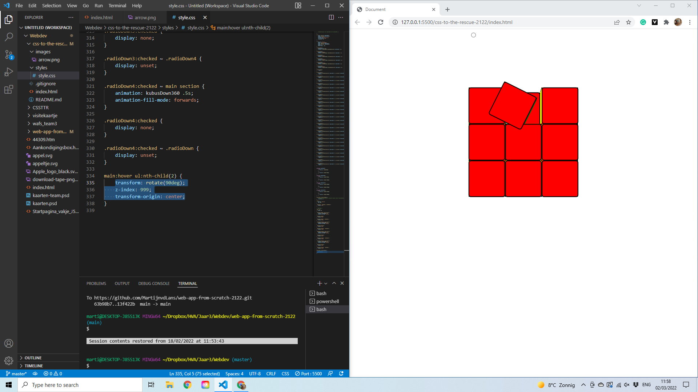
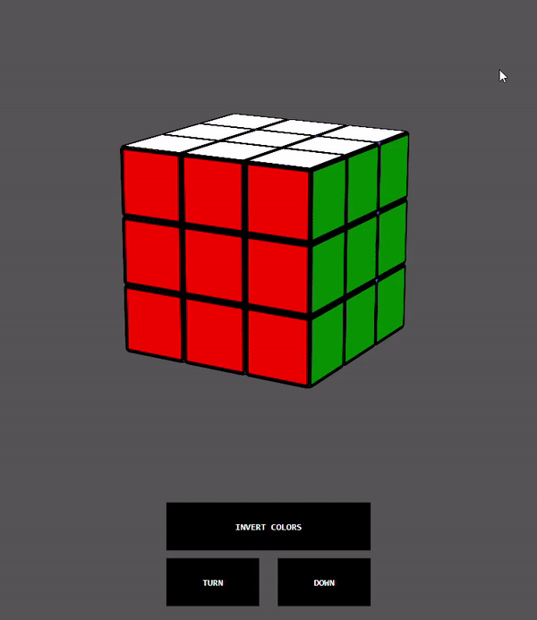
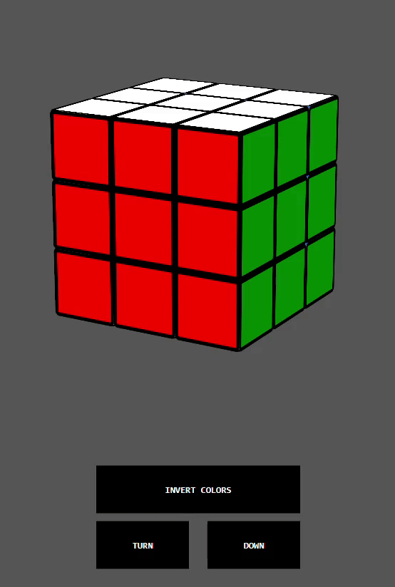

# Rubiks Cube

Ik heb gekozen om voor dit project een rubiks cube te maken. Ik heb hier voor gekozen omdat de 2 leukste opdrachten de vuurwerkshow en de rubiks cube waren. Nu weet (denk) ik dat ik wel goed ben in CSS en zo leek de Rubiks cube mij ook een grotere uitdaging dan de vuurwerkshow.

de uitdaging hier bij mij ligt in het werken met perspectieven en het proberen te gebruiken maken van variabelen voor de grootte van de kubus. Daarnaast is het gebruik van :checked en labels op deze manier nieuw voor me en zie ik dit dus ook als een uitdaging om zo min mogelijk knoppen te hebben voor de functies.

## Week 1

### Wat heb ik gedaan?

In deze week heb ik in de weinig tijd die we nog over hadden voor het eindproject er voor gezorgd dat ik 27 kubussen goed had gepositioneerd, meer was nog niet gelukt deze week.

### Waar liep ik tegen aan?

Deze week liep ik alleen aan tegen het goed zetten van het perspectief, waar ik helaas nog geen oplossing voor kon vinden.

## Week 2

### Wat heb ik gedaan deze week?

In week 1 is het mij gelukt om een kubus te maken, deze 26x te kopieren en ze ook goed te positioneren, waardoor het op een rubiks cube lijkt. Hier kwam ik al een paar uitdagingen tegen waar ik tegen aan liep, waardoor dit alles is wat ik deze week kon doen.

### Waar liep ik tegen aan?

* Perspectief

Tijdens het maken van de kubus begon ik, misschien niet al te slim, meteen met 27 kubussen (Ik voegde die in het midden ook toe, voor de zekerheid). als snel kreeg ik hierdoor problemen met perspective.

zoals je boven op de foto zit had ik moeite met het perspectief in het midden te krijgen, wat ik heel raar vond. Na een paar uur meer proberen zat ik uiteindelijk met dit hoopje chaos:

Op dit moment koos ik er ook voor het hele bestand te verwijderen en gewoon opnieuw te beginnen. Dit loste al mijn problemen op ik een half uurtje.

* Transform Origin

Een ander probleem waar ik tegen aan liep was Transform Origin. Omdat ik vanaf links boven was begonnen draaide de kubus we rond, maar niet in het midden. Hierdoor draaide de kubus met de voorkant als transform origin. Tijdens een feedback gesprek met Sanne kreeg ik een goude tip om dit op te lossen.

## Week 3

### Wat heb ik gedaan deze week?

Deze week is het mij gelukt om het transform origin op de goede positie te krijgen door de goude tip van Sanne. Om dit op te lossen heb ik alle kubussen 1 positie naar voren verplaatst, zo werd de middelste rij daadwerkelijk het midden.

naast het transform origin heb ik geprobeerd om een 1 keer de kubus te draaien. Wat uiteindelijk gelukt is na een paar pogingen. Ook heb ik deze week ervoor gezorgd dat je de kubus 360 graden kon draaien, maar dit was alleen op de X-as

Ook was het mij deze week gelukt om met 1 knop (stiekem 4 die display none en unset krijgen) de kubus 4x rond te draaien.

### Waar liep ik tegen aan?

* Draaien van 1 kant

Het eerste waar ik deze week tegen aan liep was het draaien van 1 kant van de kubus. Zoals Sanne had verteld was het handig om te beginnen met het roteren van de kubus om hem daarna pas te verplaatsen.

Waar ik al snel achter kwam was dat wanneer je een kubus draait, deze niet hetzelfde blijft translaten. Wat voorheen dus uit mijn perspectief naar onder verplaatsen was, werd nu dan bijvoorbeeld naar achter. Toen ik dit eenmaal door had ging het eigenlijk wel redelijk soepel.

* Input:checked en Labels

Waar ik ook enorm veel tijd aan kwijt was was het werken met input:checked, voornamelijk hoe 'input:checked ~' werkte om het juiste te selecteren. Omdat ik nooit Radio buttons heb gebruikt wat het concept for="" ook nieuw voor me, maar deze werd gelukkig snel duidelijk.

Waar ik pas echt tegen aan liep was dat ik 2 verschille radio buttons wilde voor opzij draaien en omhoog/omlaag draaien. Omdat ik gebruik maaktte van animaties ging 1 van de animaties niet meer af als de andere radiobutton al aan stond. 

## Week 4

### Wat heb ik gedaan?

Dit was een behoorlijk drukke week voor me, omdat ik behoorlijk achter liep met WAFS. als focus deze week begon ik met de lables goed laten functioneren, omdat dit in week 3 nog niet goed ging. Deze week heb ik er voor gekozen dit anders aan te pakken, zonder keyframe animaties. Ik heb hiervoor gekozen omdat ik met keyframe animaties met te veel factoren rekening moest houden en enorm veel labels zou hebben.

Door mee te kijken met anderen uit de klas kwam ik er achter dat er een makkelijkere manier was die maar om 8 inputs/labels in totaal vroeg. Zo is het me uiteindelijk gelukt om de kubus rond te laten draaien, helaas zorgde dit er wel voor dat de kubus terug schiet wanneer deze terug draait naar het eerste vlak, wat jammer is, maar nu gelukkig wel op elk but naar boven en beneden kan draaien.

Vervolgen wou ik kijken of ik voor het draaien van een vlak kon krijgen in een knop inplaats van een hover, helaas liep ik hier enorm tegen aan.

In de tijd dat ik zat na te denken hoe ik dit kon oplossen wou ik wat toevoegen aan de kubus, zo kwam ik op het idee om een invert button toe te voegen, waardoor de kleuren verwisselen.

Wat ik ook heb veranderd, is dat eerst alle kubussen dezelfde kleuren hadden. Ik heb nu geprobeerd om alle kleuren alleen vanaf 1 kant te laten zien met nth selectoren om de rest zwart te laten. Op deze manier ziet de kubus er overtuigender uit.

Dit is daar het eindresultaat van.

### Waar liep ik tegen aan?

* Knop om te draaien

Waar ik deze week enorm tegen aan liep was om een knop te maken en zo de vlakken te laten draaien. Pas in het laatste uur kwam ik op een idee om dit te verbeteren, wat ik enorm jammer vind. Dit is dan ook helaas niet meer gelukt.

### Wat ik nog had willen doen

Ik ben enorm tevreden wat ik neer heb gezet. Vooral omdat ik nog niet eerder heb gewerkt met perspectief, 3d en interactie in CSS met input. 

| | Gedaan |
| ------------- | ------------- |
| 1 kubus maken | ✅ |
| 27 kubussen positioneren om een rubiks cube te maken | ✅ |
| Knoppen om de kubus te laten draaien | ✅ |
| Invert Colors | ✅ |
| 1 kant laten draaien | ✅ |
| Opmaak voor de kubus | ✅ |
| Meerdere kanten laten draaien | - |
| Knoppen om minimaal 1 kant te laten draaien | - |

### Waar ben ik blij mee?

Ik ben enorm blij dat het uberhaupt gelukt is om een kubus te maken, maar waar ik helemaal tevreden mee ben is dat het me gelukt is om alle 8 knoppen op 3 knoppen te laten lijken.

Daarnaast ben ik enorm blij het je vanaf iedere zijnde omhoog en omlaag kan kijken bij de kubus. 

En tot slot ben ik enorm blij dat het met gelukt is om alles te doen met 1 var. Achteraf had ik beter meer variabelen kunnen gebruiken en dat zal ik in de toekomst ook zeker doen.